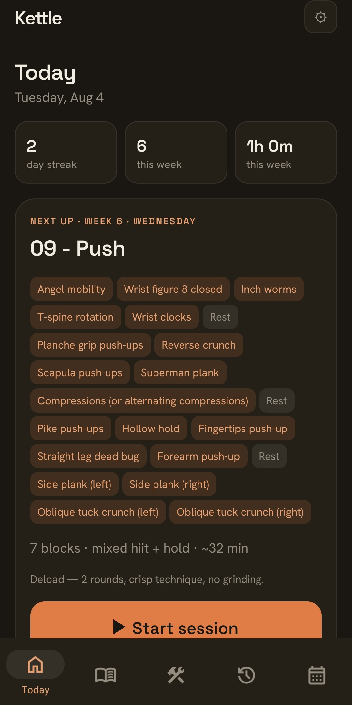
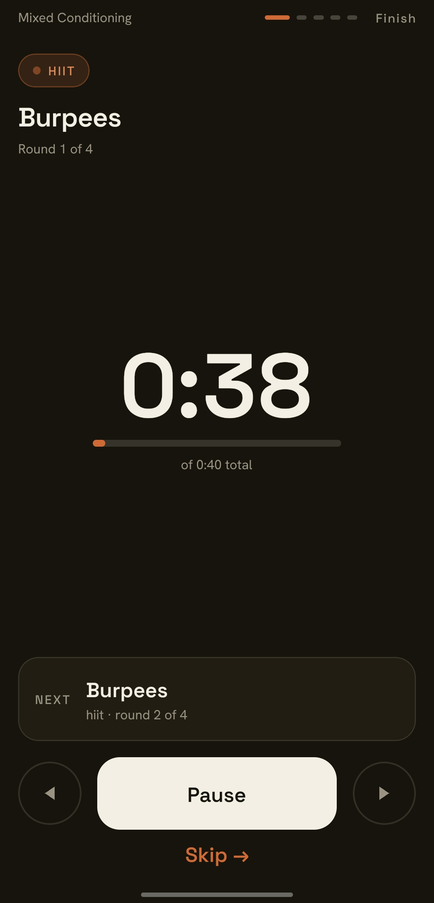

# Kettle

A backend-free workout tracker for Android. Exercises, workouts and multi-week programs live in a
hand-editable YAML file you own; completed sessions are written by the app to a local, append-only
log. No server, no account, nothing transmitted.

**[Landing site](https://celsaad.github.io/kettle/)** ·
[format reference](https://celsaad.github.io/kettle/format.html) ·
[example libraries](https://celsaad.github.io/kettle/examples.html)

<p>
  
  
  
</p>

## What it does

- **A live session runner** for all seven exercise types (hiit / emom / amrap / reps / timed_hold /
  cardio / rest). Timing is wall-clock-based, so it survives backgrounding, and every completed set
  flushes to disk as it happens.
- **Full in-app CRUD** for exercises, workouts — including circuits and supersets — and multi-week
  programs with per-week overrides. Hand-editing the YAML is a power-user option, not a requirement.
- **Import merges by `id`**, from a file or pasted text, shown as a field-level diff before a single
  byte is written. A library from anywhere can be accepted without losing your own.
- **Bring your own assistant.** Import copies a generated JSON Schema plus every id already in your
  library, so what an LLM writes references your exercises instead of inventing near-duplicates.
  Kettle never calls a model itself: it supplies the format and validates the result, and what you
  should actually be doing in a workout stays between you and whoever you asked.
- **History and progression** — per-exercise volume charts, current streak and weekly totals, all
  read back from the local log. Export the library or the whole log as plain files any time.
- **English and Brazilian Portuguese**, the seeded starter library included, with dates, numbers,
  first day of week and kg/lb following the device locale. User data is never translated.
- **Accessible by house rule** — roles and labels on every control, 44px targets, contrast-checked
  colors, screen-reader announcements in the runner, and reduce-motion support.
- **No ads, no account, no subscription, no analytics or third-party purchase SDK**, so the Play
  Data Safety declaration stays at zero data collected. An optional tip jar (Google Play Billing)
  gates nothing and exists only to offset the Play developer fee.

## Install

Not on Google Play yet. iOS is not planned — [the site](https://celsaad.github.io/kettle/) carries
current status.

## Development

```bash
corepack enable      # once; pnpm is pinned by "packageManager" in package.json
pnpm install
pnpm expo start
```

**pnpm, not npm.** `pnpm-workspace.yaml` sets `nodeLinker: hoisted`, which Metro and Gradle
autolinking both need — installing with another manager works but drops the settings that keep the
tree resolvable. See the decision log for the measurements behind the choice.

The output offers a [development build](https://docs.expo.dev/develop/development-builds/introduction/),
an [Android emulator](https://docs.expo.dev/workflow/android-studio-emulator/), an
[iOS simulator](https://docs.expo.dev/workflow/ios-simulator/), [Expo Go](https://expo.dev/go), or
the web.

**Web has no persistence.** `expo-file-system` doesn't support it, so `pnpm expo start --web` degrades
to an ephemeral in-memory seed library rather than crashing.

Routing is [Expo Router](https://docs.expo.dev/router/introduction) file-based; screens live under
`src/app`.

## Project structure

```
src/
  app/                  routes (Expo Router): (tabs)/ for the five tab screens, plus session,
                         import, settings, support, the program guide, and the exercise /
                         workout / program editors and program detail as modal routes
  components/           shared UI (themed primitives, session runner sub-views, kettle mark)
  constants/            theme tokens, with the measured contrast ratios recorded alongside them
  domain/               types, zod schemas, YAML<->domain mapping, library merge, display formatting,
                         kg/lb conversion
  storage/              file I/O (expo-file-system): library, sessions, export, tip and app preferences
  state/                zustand stores (library, session history, tip, preferences) + derived-display
                         selectors
  hooks/                theme context, session runner and its pure step model, announcements
  i18n/                 i18next setup and the en / pt locale bundles
  test-support/         shared fixtures and the expo-router stand-in used by the test suite
site/                   the public landing site (GitHub Pages), static HTML, no build step
store/                  Play listing copy and generated store graphics
```

## Scripts

```bash
pnpm run typecheck    # tsc --noEmit
pnpm run lint         # oxlint
pnpm test             # jest, via jest-expo
pnpm run format       # oxfmt (markdown and package.json are excluded on purpose)
```

All three checks run in CI (`.github/workflows/ci.yml`) on every push and pull request. The suite
covers the domain layer, the session runner, the stores and the highest-branch screens; layout,
animation, real audio and file writes are verified by driving the running app instead.

## Docs

| Doc | What it's for |
| --- | --- |
| [`AGENTS.md`](AGENTS.md) | How to work in this repo — conventions, house rules, and the traps worth knowing before you start |
| [`docs/product-plan.md`](docs/product-plan.md) | The product model: data model, file formats, roadmap |
| [`docs/authoring-exercises-yaml.md`](docs/authoring-exercises-yaml.md) | YAML reference, kept exact against `schema.ts` |
| [`docs/decisions.md`](docs/decisions.md) | The decision log — why things are the way they are |
| [`docs/open-work.md`](docs/open-work.md) | What's genuinely still open |
| [`docs/history.md`](docs/history.md) | Write-ups of shipped work, where the reasoning outlived the commit |

`AGENTS.md` lists the rest.

## Privacy and license

Kettle collects nothing, transmits nothing, and makes no network requests — see
[`PRIVACY.md`](PRIVACY.md). The code is MIT licensed ([`LICENSE`](LICENSE)); your library and session
log are yours and were never anyone else's.
